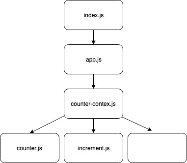

#  LAB

## lab-33-context-api-part1

### Author: Bonnie Wang

### Links and Resources

- [submission PR](http://xyz.com)

#### Documentation

- [api docs](http://xyz.com) (API servers)
- [jsdoc](http://xyz.com) (Server assignments)
- [styleguide](http://xyz.com) (React assignments)

### Modules

#### `index.js`

#### `app.js`

### Components

#### `counter.js` -> displays counter

#### `decrement.js` -> decrements counter

#### `increment.js` -> increments counter

### Context

#### `counter-context.js` -> stores state of counter

#### Running the app

- `npm i`
- `npm start`

#### UML

                            decrement.js
